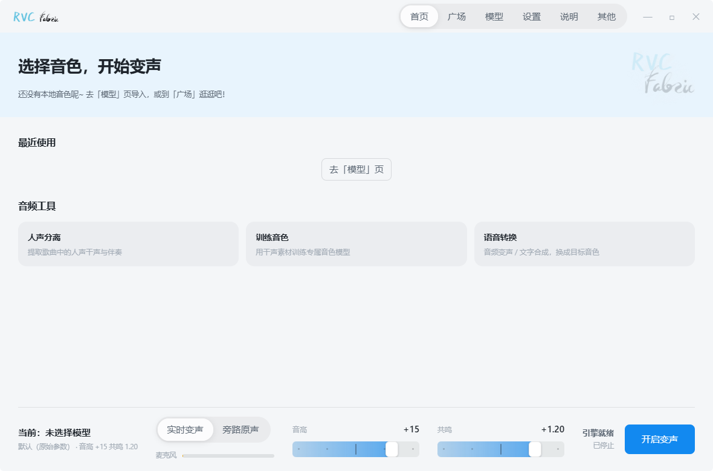
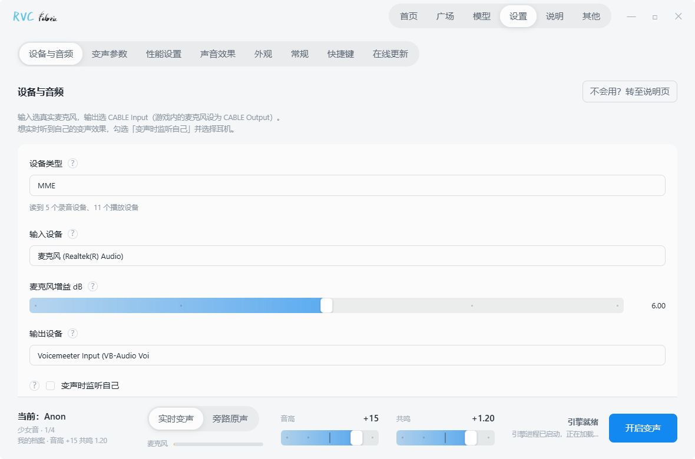
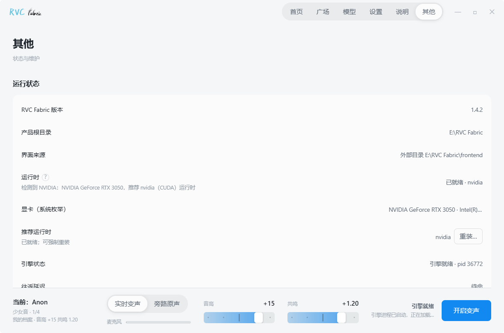

<div align="center">


# RVC Fabric

<!-- lang-nav -->
[简体中文](./README.md)　·　[繁體中文](./README_zh-TW.md)　·　[English](./README_en.md)　·　[日本語](./README_ja.md)　·　한국어　·　[Español](./README_es.md)　·　[Français](./README_fr.md)　·　[Русский](./README_ru.md)
<!-- lang-nav -->

**고성능 실시간 AI 변조 데스크톱 클라이언트**

<!-- screenshots -->



<!-- screenshots -->

[RVC WebUI](https://github.com/RVC-Project/Retrieval-based-Voice-Conversion-WebUI) 기반 딥 커스터마이징 · [Turing Mirror](https://github.com/Turing-Mirror) 개발 및 유지보수

[](./LICENSE)
[](https://github.com/RVC-Project/Retrieval-based-Voice-Conversion-WebUI)

[GitHub 저장소](https://github.com/Turing-Mirror/RVC-Fabric) · [CNB 아티팩트 다운로드](https://cnb.cool/Turing-Mirror/RVC-Fabric-Releases)

**소셜 미디어**　[Bilibili @TuringMirror](https://space.bilibili.com/3546871148579062)　·　[Douyin @TuringMirror](https://v.douyin.com/6NxXcrKK9cc) (Douyin ID `TuringMirror`)　·　[Xiaohongshu @TuringMirror](https://www.xiaohongshu.com/user/profile/65f56bf1000000000b00e094) (Xiaohongshu ID `TuringMirror`)　·　QQ 그룹 @TuringMirror 커뮤니티 (그룹 번호 `1077458748`)

<!-- qq-group -->

<!-- qq-group -->

**후원 프로모션**　[첫 달 50% 할인　·　가성비 클라우드 서버 / 게임 클라우드 / 패널 서버　·　Rainyun](https://www.rainyun.com/m1rror_?s=RVC-Fabric)

</div>

---

## 프로젝트 소개

RVC Fabric은 Windows용 실시간 AI 변조 데스크톱 소프트웨어로, 설치 즉시 사용할 수 있습니다. Python이나 PyTorch를 직접 설치할 필요가 없으며, 브라우저를 열어 Gradio 페이지를 클릭할 필요도 없이 설치만 하면 바로 변조가 가능합니다.

게임 음성 채팅, 라이브 스트리밍, 오디오 제작 — 지연 시간이 짧고 원음을 고도로 재현하는 실시간 음색 변환을 소프트웨어 하나로 해결하세요.

## 핵심 기능

- **실시간 변조**: 짧은 지연 시간의 실시간 추론, 변조 중 매끄러운 음색 전환, 「실시간 변조 / 우회 원음 (Bypass)」 원클릭 전환.
- **DSP 이펙트 체인**: 포스트 레벨 노이즈 게이트, 다이내믹 컴프레서 및 5밴드 파라메트릭 이퀄라이저 내장, 프리셋 적용 및 정밀 튜닝 지원.
- **음색 및 프리셋 관리**: 그리드형 음색 라이브러리, .index 검색 특징 라이브러리 바인딩, 매개변수 프리셋 저장, 가져오기, 내보내기 및 공유 가능.
- **커뮤니티 음색 광장**: 듀얼 소스 스토어 (Turing Mirror 공식 소스 + 서드파티 오픈 소스), 멀티스레드 동시 다운로드 및 이어받기 지원.
- **내장 오디오 툴박스**:
  - **보컬 분리**: PyMSS 분리 모델 기반으로 원음과 반주를 빠르게 추출.
  - **음성 합성**: 텍스트를 입력하여 음성을 생성하고 목표 음색으로 자동 변환 (TTS + RVC).
  - **음색 훈련**: 내장 훈련 패널을 통해 전용 음색 원클릭 훈련 (NVIDIA 그래픽 카드 필요).
- **전자동 하드웨어 가속**: NVIDIA CUDA (RTX 50 시리즈 포함) 및 AMD / Intel (DirectML) 자동 인식, 해당 컴퓨팅 런타임 다운로드.

## 시작하기

### 1. 설치 및 초기화

1. [Releases 페이지](https://github.com/Turing-Mirror/RVC-Fabric/releases)에서 `RVC_Fabric_Setup.exe` 다운로드;
2. 설치 프로그램 실행 (영문 경로 설치 권장);
3. 소프트웨어를 시작하고 안내에 따라 하드웨어 인식, 런타임 보완 및 가상 사운드 카드 설치 자동 완료.

### 2. 오디오 라우팅 (가상 사운드 카드 연결 방법)

게임, QQ, Discord 또는 라이브 스트리밍 소프트웨어에서 사람들이 변조된 목소리를 듣게 하려면 중간에 VB-Cable 가상 사운드 카드를 거쳐야 합니다:

| 설정 항목 | 권장 선택 | 설명 |
| :--- | :--- | :--- |
| **소프트웨어 입력** | 실제 마이크 | 말하는 원본 목소리 수음 |
| **소프트웨어 출력** | **CABLE Input** | 변조 결과를 가상 사운드 카드로 전송 |
| **모니터링 (선택)** | 물리적 이어폰 / 스피커 | 로컬에서 실시간 변조 효과 청취 |
| **게임 / 음성 마이크** | **CABLE Output** | 서드파티 소프트웨어에서 변조 효과 수신 |
| **Windows 기본 재생** | 물리적 이어폰 (CABLE 선택 금지) | 시스템의 다른 소리가 정상적으로 재생되도록 보장 |

## 기술 아키텍처 및 개발

### 아키텍처

RVC Fabric은 **Tauri + Rust + React** 데스크톱 셸을 채택했으며, 백그라운드에서는 **Python Worker**가 모든 컴퓨팅을 담당하며, 둘은 JSON 파일 프로토콜을 통해 통신합니다:

```
RVC Fabric.exe (Tauri + Rust + React 프론트엔드 메인 인터페이스)
    │
    ▼ JSON 파일 프로토콜 (command.json / status.json / worker.pid)
Runtime\pythonw.exe tools/realtime_worker.py (Python 3.9 + CUDA / DirectML)
    └─> gui_v1.py (AudioIoProcess + rtrvc 실시간 추론 엔진)
```

업스트림 훈련 / 추론 WebUI (Gradio)는 고급 기능으로 패키지에 유지되며, 「기타」 페이지에서 열 수 있습니다.

### 환경 요구 사항 및 개발

**환경 요구 사항**: Windows 10/11 · Node.js 20+ · Rust Stable · Python 3.13 (개발 스크립트)

```bash
# 1. 프론트엔드 의존성 설치
cd app
npm install

# 2. 데스크톱 개발 모드 시작 (WebView2 및 MSVC 툴체인 필요)
npm run tauri:dev

# 3. UI 브라우저 미리보기만 시작
npm run dev
```

### 빌드 및 테스트

- **단위 테스트**: `scripts\run_tests.bat` 실행
- **설치 프로그램 패키징 (NSIS)**: `cd app && npm run tauri:build`
- **전체 오프라인 패키지 패키징**: `python scripts\build_release.py --variant nvidia|amd|nvidia50`
- **온라인 매니페스트 빌드**: `python scripts\build_catalog.py build --diff`

## 오픈 소스 라이선스 및 면책 조항

- 본 프로젝트의 소스 코드는 [MIT License](./LICENSE) 라이선스에 따라 오픈 소스로 제공됩니다.
- 모델 가중치, 음색 패키지 및 서드파티 리소스는 원래 라이선스를 따릅니다.
- **면책 조항**: 본 소프트웨어를 신분 위조, 사기, 괴롭힘 또는 승인되지 않은 불법적인 목적으로 사용하지 마십시오. 타인의 목소리를 훈련이나 변환에 사용하기 전에 원래 권리자의 명시적인 승인을 받아야 합니다. 위반 사용으로 인해 발생하는 모든 법적 결과는 사용자가 책임을 집니다.

## 감사의 글

RVC Fabric에 기술적 지원을 제공한 훌륭한 오픈 소스 프로젝트에 감사드립니다:

- [Retrieval-based-Voice-Conversion-WebUI](https://github.com/RVC-Project/Retrieval-based-Voice-Conversion-WebUI) — 핵심 알고리즘 및 업스트림 기초
- [ContentVec](https://github.com/auspicious3000/contentvec) · [VITS](https://github.com/jaywalnut310/vits) · [HiFi-GAN](https://github.com/jik876/hifi-gan) · [RMVPE](https://github.com/Dream-High/RMVPE) — 핵심 음향 모델 및 피치 알고리즘
- [faiss](https://github.com/facebookresearch/faiss) · [TorchGate](https://github.com/timsainb/TorchGate) — 검색 및 실시간 노이즈 감소
- [FCPE](https://github.com/CNChTu/FCPE) · [Parselmouth](https://github.com/YannickJadoul/Parselmouth) · [torchcrepe](https://github.com/maxrmorrison/torchcrepe) — 선택적 피치 알고리즘
- [Ultimate Vocal Remover](https://github.com/Anjok07/ultimatevocalremovergui) (UVR 계열 분리 모델, PyMSS를 통해 실행) · [FFmpeg](https://github.com/FFmpeg/FFmpeg) — 보컬 분리 및 오디오 처리
- [VB-Audio Virtual Cable](https://vb-audio.com/Cable/) — 가상 사운드 카드 (게임에서 변조된 목소리를 들을 수 있게 함)
